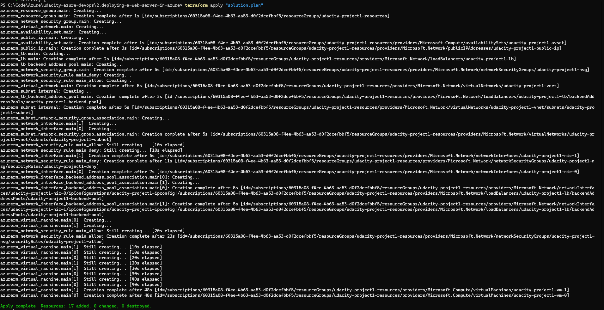
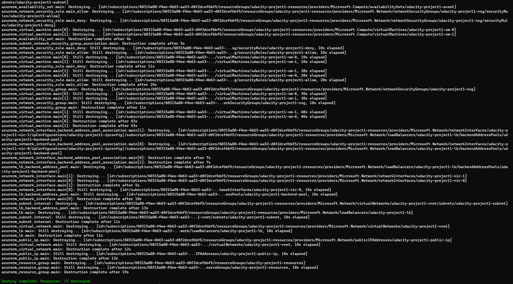

# Azure Infrastructure Operations Project: Deploying a scalable IaaS web server in Azure

### Introduction

In this repository, you will use a Packer template and a Terraform template to deploy a customizable, scalable web server in Azure.

### Getting Started

1. Clone this repository

2. Download the dependencies below

3. Following the README to deploy resources.

### Dependencies

1. Create an [Azure Account](https://portal.azure.com)
2. Install the [Azure command line interface](https://docs.microsoft.com/en-us/cli/azure/install-azure-cli?view=azure-cli-latest)
3. Install [Packer](https://www.packer.io/downloads)
4. Install [Terraform](https://www.terraform.io/downloads.html)

## Instructions
1. Login to Azure
```bash
az login
```
2. Create a new Azure policy

Open folder containing the resources you want to deploy with terminal.\
Run the following command to deploy the policy:

```bash
az policy definition create -n "tagged-policy" --mode Indexed --rules "./tagging-policy.rules.json" --description "Ensures all indexed resources are tagged"
```
```bash
az policy assignment create --policy "tagged-policy" -n "tagged-policy" --description "Ensures all indexed resources are tagged"
```

3. Create a new Azure resource group
```bash
az group create -l "eastasia" -n "udacity-vm-images" --tags "udacity[=project1]"
```

4. Deploy a new image to Azure
```bash
packer build .\server.json
```

5. Deploy resouces using terraform

You can config the vars.tf file to set the following variables:
prefix: The prefix of the resources name
- location: The location of the resources
- packer_image_name: The name of the image created by packer
- packer_image_resource_group_name: The resource group of the image created by packer
- username: The username of the VMs
- password: The password of the VMs
- number_of_vms: The number of VMs to deploy

Run the following command to deploy the resources:
```bash
terraform init
terraform.exe plan -out solution.plan
terraform apply "solution.plan"
```
When you want to destroy the resources, run the following command:
```bash
terraform destroy
```
### Output
1. You should see the following output when you use `az policy assignment list` to show the list of policy assignment:

2. When you use `az image show -n "udacity-vm-image" -g "udacity-vm-images"`, you should see the detail of following image:

3. You should see the following output when you run command `terraform apply "solution.plan"` as instructed above:

4. You should see the following output when you run command `terraform destroy`:
